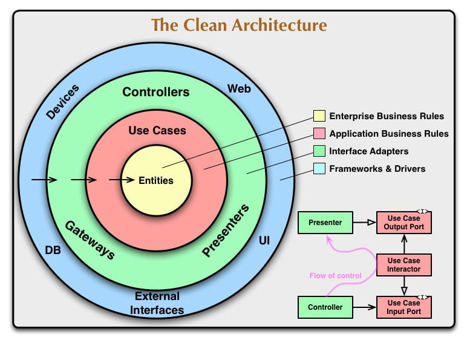
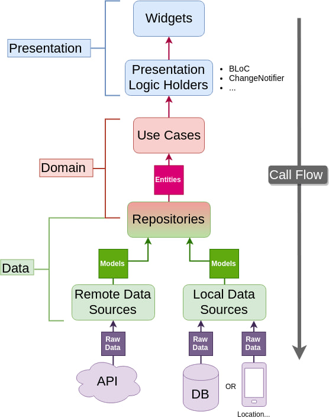

# 📚 Bookly App — Clean Architecture in Flutter

<div align="center">


**A Flutter project built with Clean Architecture principles to demonstrate professional app structure, scalability, and maintainability.**


</div>

---

## 🎯 Project Overview

**Bookly** is a Flutter application that displays books using real API data from Google Books API. 

**The primary purpose of this project is to practice and demonstrate Clean Architecture implementation in Flutter** — not to build a production-ready book app, but to **showcase best practices** in:

- ✅ Separating concerns into **Data**, **Domain**, and **Presentation** layers
- ✅ Enforcing **Dependency Inversion Principle**
- ✅ Promoting **testability** and **scalability**
- ✅ Writing **maintainable** and **modular** code

This project serves as a **learning resource** and **portfolio piece** for developers who want to understand how to structure Flutter apps professionally using Clean Architecture.

---

## 🧰 **Tech Stack**

> The project is built using a modern Flutter ecosystem to ensure scalability, maintainability, and adherence to Clean Architecture principles.

- **Flutter** — Cross-platform UI framework for building native apps  
- **Dart** — Core programming language used for Flutter development  
- **Bloc / Cubit** — Reactive and predictable state management  
- **Dio** — HTTP client for handling API requests  
- **Hive** — Local database for caching and persistence  
- **GetIt** — Dependency injection using the service locator pattern  
- **GoRouter** — Declarative navigation and routing solution  
- **Dartz** — Functional programming utilities (Either, Failure handling)  
- **Equatable** — Simplifies value equality for cleaner state comparison  
- **flutter_dotenv** — Environment variables management  


---

## 🏗️ Clean Architecture Breakdown

This project follows **Uncle Bob's Clean Architecture** principles, organizing the codebase into **three independent layers**:





### 📐 The Dependency Rule

> **Dependencies always point inward** — from outer layers (Presentation/Data) toward the core (Domain).

The **Domain layer** is the heart of the application:
- ❌ **Does NOT** depend on Flutter or any external framework
- ✅ Contains **pure business logic**
- ✅ Defines **abstract contracts** (Repositories)
- ✅ Holds **Use Cases** (application-specific operations)

---

### 1️⃣ Domain Layer — The Core 🧠

**Location:** `lib/features/books/domain/`

The domain layer is the **most important** layer. It contains:

#### 📦 Entities
Pure Dart objects representing business concepts:

```dart
class BookEntity {
  final String id;
  final String title;
  final String author;
  final num price;
  final num rating;
  final String imageUrl;

  BookEntity({
    required this.id,
    required this.title,
    required this.author,
    required this.imageUrl,
    required this.price,
    required this.rating,
  });
}
```

#### 📋 Repository Interfaces
Abstract contracts that define **what** operations are needed (not **how**):

```dart
abstract class BooksRepository {
  Future<Either<Failure, List<BookEntity>>> getNewestBooks({int pageNumber = 0});
}
```

#### 🎯 Use Cases
Single-responsibility classes that execute specific business operations:

```dart
class GetFeaturedBooksUseCase extends UseCase<List<BookEntity>, int> {
  final BooksRepository repository;

  GetFeaturedBooksUseCase({required this.repository});

  @override
  Future<Either<Failure, List<BookEntity>>> call(int pageNumber) async {
    // 💡 Note:
    // A UseCase is not always just a direct call to the repository.
    // It can contain business logic that belongs to the "Domain" layer.
    //
    // Example:
    // You might want to check if the user is connected to the internet
    // before calling the repository, to avoid unnecessary API calls.
    //
    // if (!await NetworkInfo.isConnected()) {
    //   return Left(NoInternetConnectionFailure());
    // }

    return await repository.getNewestBooks(pageNumber: pageNumber);
  }
}

```

**Why Use Cases?**
- ✅ Encapsulate business logic
- ✅ Reusable across different features
- ✅ Easy to test independently
- ✅ Follow Single Responsibility Principle

---

### 2️⃣ Data Layer — Implementation Details 🔌

**Location:** `lib/features/books/data/`

This layer **implements** the repositories defined in the domain layer and handles:

#### 🌐 Remote Data Source
Fetches data from Google Books API using **Dio**:

```dart
class BooksRemoteDataSourceImpl implements BooksRemoteDataSource {
  final ApiService apiService;
  const BooksRemoteDataSourceImpl({required this.apiService});

  @override
  Future<List<BookModel>> getNewestBooks({int pageNumber = 0}) async {
    return getBooks(orderBy: ApiConstants.orderNewest, pageNumber: pageNumber);
  }

  Future<List<BookModel>> getBooks({required String orderBy, int pageNumber = 0}) async {
    final startIndex = pageNumber * 10;
    final response = await apiService.getVolumes(
      query: 'programming',
      filter: ApiConstants.filterFreeEbooks,
      maxResults: ApiConstants.defaultMaxResults,
      orderBy: orderBy,
      startIndex: startIndex,
    );
    return processResponse(response);
  }

  List<BookModel> processResponse(Response response) {
    if (response.statusCode == 200) {
      final data = response.data as Map<String, dynamic>;
      final items = data['items'] as List<dynamic>?;
      if (items == null || items.isEmpty) return [];
      return items.map((json) => BookModel.fromJson(json as Map<String, dynamic>)).toList();
    } else {
      throw ServerException(
        statusCode: response.statusCode ?? 0,
        responseData: response.data,
      );
    }
  }
}

```

#### 💾 Local Data Source
Caches data locally using **Hive**:

```dart
class BooksLocalDataSourceImpl implements BooksLocalDataSource {
  const BooksLocalDataSourceImpl();

  @override
  Future<void> cacheNewestBooks(List<BookModel> books) async {
    final box = HiveHelper.newestBooksBox;
    for (final book in books) {
      if (book.bookId.isEmpty) continue;
      await box.put(book.bookId, book);
    }
  }

  @override
  Future<List<BookModel>> getCachedNewestBooks({int pageNumber = 0}) async {
    final box = HiveHelper.newestBooksBox;
    if (box.isEmpty) return const [];

    final startIndex = pageNumber * 10;
    final endIndex = startIndex + 10;
    final cachedBooks = box.values.toList();

    if (startIndex >= cachedBooks.length) return const [];
    return cachedBooks.sublist(
      startIndex,
      endIndex > cachedBooks.length ? cachedBooks.length : endIndex,
    );
  }
}

```

#### 🏛️ Repository Implementation
Combines remote and local data sources, handles errors, and converts models to entities:

```dart
class BooksRepositoryImpl implements BooksRepository {
  final BooksRemoteDataSource remoteDataSource;
  final BooksLocalDataSource localDataSource;

  BooksRepositoryImpl({
    required this.remoteDataSource,
    required this.localDataSource,
  });

  @override
  Future<Either<Failure, List<BookEntity>>> getNewestBooks({int pageNumber = 0}) async {
    final cachedResult = await getNewestBooksFromCache(pageNumber: pageNumber);

    return cachedResult.fold(
      (failure) async {
        try {
          final remoteBooks = await remoteDataSource.getNewestBooks(pageNumber: pageNumber);
          await localDataSource.cacheNewestBooks(remoteBooks);
          return Right(remoteBooks.cast<BookEntity>());
        } on DioException catch (e) {
          return left(ServerFailure.fromDioError(e));
        } on ServerException catch (e) {
          return left(ServerFailure.fromResponse(
            response: e.responseData,
            statusCode: e.statusCode,
          ));
        } catch (e) {
          return left(ServerFailure(message: e.toString()));
        }
      },
      (cachedBooks) => Right(cachedBooks),
    );
  }

  Future<Either<Failure, List<BookEntity>>> getNewestBooksFromCache({int pageNumber = 0}) async {
    try {
      final cachedBooks = await localDataSource.getCachedNewestBooks(pageNumber: pageNumber);
      if (cachedBooks.isEmpty) {
        return const Left(CacheFailure(message: 'No cached data available.'));
      }
      return Right(cachedBooks.cast<BookEntity>());
    } catch (e) {
      return Left(CacheFailure(message: e.toString()));
    }
  }
}

```

**Key Points:**
- ✅ Repository decides whether to use remote or local data
- ✅ Converts **Models** (data layer) → **Entities** (domain layer)
- ✅ Handles errors gracefully using **Either** from Dartz
- ✅ Implements **offline-first** strategy with caching

---

### 3️⃣ Presentation Layer — User Interface 🎨

**Location:** `lib/features/books/presentation/`

This layer handles everything related to the UI:

#### 🎭 State Management (Cubit)
Manages UI state using **Cubit** from flutter_bloc:

```dart
class NewestBooksCubit extends Cubit<NewestBooksState> {
  final GetNewestBooksUseCase getNewestBooksUseCase;
  NewestBooksCubit({required this.getNewestBooksUseCase})
      : super(NewestBooksInitial());
  List<BookEntity> newestBooks = [];
  Future<void> getNewestBooks({int pageNumber = 0}) async {
    pageNumber == 0
        ? emit(NewestBooksLoading())
        : emit(NewestBooksPaginationLoading(newestBooks: newestBooks));
    final result = await getNewestBooksUseCase.call(pageNumber);
    result.fold(
        (failure) => pageNumber == 0
            ? emit(NewestBooksFailure(errorMessage: failure.message))
            : emit(NewestBooksPaginationFailure(
                errorMessage: failure.message,
                newestBooks: newestBooks,
              )), (books) {
      newestBooks = [...newestBooks, ...books];
      emit(NewestBooksSuccess(newestBooks: newestBooks));
    });
  }
}
```

#### 📱 UI Widgets
Flutter widgets that display data and listen to state changes:

```dart
BlocBuilder<NewestBooksCubit, NewestBooksState>(
      builder: (context, state) {
        switch (state) {
          case NewestBooksInitial():
          case NewestBooksLoading():
            return const CircularProgressIndicator();
          case NewestBooksSuccess():
            return NewestBooksListView(books: state.newestBooks);
          case NewestBooksPaginationLoading():
            return NewestBooksListView(books: state.newestBooks);
          case NewestBooksPaginationFailure():
            return NewestBooksListView(books: state.newestBooks);
          case NewestBooksFailure():
            return Text(state.errorMessage);
        }
      },
    )
```

**Why Cubit?**
- ✅ Simpler than full BLoC (no events needed)
- ✅ Predictable state management
- ✅ Easy to test
- ✅ Works seamlessly with flutter_bloc

---

## 📂 Project Structure

```
lib/
│
├── core/
│   ├── api/
│   │   ├── api_constants.dart          # API endpoints and config
│   │   ├── api_service.dart            # Dio service wrapper
│   │
│   ├── error/
│   │   ├── exceptions.dart             # Data layer exceptions
│   │   └── failures.dart               # Domain layer failures
│   │
│   ├── usecases/
│   │   └── usecase.dart                # Base UseCase abstract class
│   │
│   └── utils/
│   │    ├── helpers/
│   │    │   └── hive_helper.dart        # Manages Hive boxes
│   │    ├── app_router.dart             # GoRouter configuration
│   │    ├── styles.dart                 # App theme and colors
│   │    └── assets.dart                 # Manages app asset paths
│   │    
│   └── service_locator.dart             # Registers and provides app dependencies
│
├── features/
│   └── books/
│       │
│       ├── data/
│       │   ├── datasources/
│       │   │   ├── books_remote_data_source.dart
│       │   │   └── books_local_data_source.dart
│       │   │
│       │   ├── models/
│       │   │   ├── book_model.dart
│       │   │   └── book_model.g.dart         # Hive adapter
│       │   │
│       │   └── repositories/
│       │       └── books_repository_impl.dart
│       │
│       ├── domain/
│       │   ├── entities/
│       │   │   └── book_entity.dart
│       │   │
│       │   ├── repositories/
│       │   │   └── books_repository.dart     # Abstract interface
│       │   │
│       │   └── usecases/
│       │       ├── get_featured_books_usecase.dart
│       │       └── get_newest_books_usecase.dart
│       │
│       └── presentation/
│           ├── manager/
│           │   ├── featured_books_cubit/
│           │   │   ├── featured_books_cubit.dart
│           │   │   └── featured_books_state.dart
│           │   │
│           │   └── newest_books_cubit/
│           │       ├── newest_books_cubit.dart
│           │       └── newest_books_state.dart
│           │
│           └── views/
│               ├── books_view.dart
│               └── widgets/
│                   ├── books_view_body.dart
│                   ├── featured_books_list.dart
│                   ├── newest_books_list.dart
│                   └── book_card.dart
│
└── main.dart                               # App entry point
│
└── simple_bloc_observer.dart               # Logs BLoC events, transitions, and errors

```

---

## 🔄 Data Flow & Architecture Diagram
<div align="center">
  
</div>


---

## ⚙️ Dependency Injection with GetIt

All dependencies are registered centrally in `injection_container.dart` using **GetIt**:

```dart

final getIt = GetIt.instance;

void setupServiceLocator() {
  getIt.registerLazySingleton<ApiService>(() => ApiService());
  getIt.registerLazySingleton<BooksRemoteDataSource>(
    () => BooksRemoteDataSourceImpl(apiService: getIt<ApiService>()),
  );
  getIt.registerLazySingleton<BooksLocalDataSource>(
    () => const BooksLocalDataSourceImpl(),
  );
  getIt.registerLazySingleton<BooksRepository>(
    () => BooksRepositoryImpl(
      remoteDataSource: getIt<BooksRemoteDataSource>(),
      localDataSource: getIt<BooksLocalDataSource>(),
    ),
  );
  getIt.registerLazySingleton<GetFeaturedBooksUseCase>(
    () => GetFeaturedBooksUseCase(booksRepository: getIt<BooksRepository>()),
  );
  getIt.registerLazySingleton<GetNewestBooksUseCase>(
    () => GetNewestBooksUseCase(booksRepository: getIt<BooksRepository>()),
  );
  getIt.registerFactory<FeaturedBooksCubit>(
    () => FeaturedBooksCubit(
        getFeaturedBooksUseCase: getIt<GetFeaturedBooksUseCase>()),
  );
  getIt.registerFactory<NewestBooksCubit>(
    () =>
        NewestBooksCubit(getNewestBooksUseCase: getIt<GetNewestBooksUseCase>()),
  );
}

```

**Benefits:**
- ✅ Centralized dependency management
- ✅ Easy to swap implementations (e.g., mock for testing)
- ✅ Lazy initialization for better performance
- ✅ Clean and testable code

---

## 🌐 API Integration

### Google Books API

The app fetches data from the [Google Books API](https://developers.google.com/books):

**Endpoint:** `https://www.googleapis.com/books/v1/volumes`

**Example Request:**
```
GET /volumes?q=programming&filter=free-ebooks&maxResults=20&orderBy=newest
```

### API Service Layer

```dart
class ApiService {
  final Dio dio;

  Future<Response> getVolumes({
    required String query,
    String? filter,
    int? maxResults,
    String? orderBy,
    int? startIndex,
  }) async {
    return await dio.get(
      ApiConstants.volumes,
      queryParameters: {
        'q': query,
        if (filter != null) 'filter': filter,
        'maxResults': maxResults ?? 20,
        if (orderBy != null) 'orderBy': orderBy,
        if (startIndex != null) 'startIndex': startIndex,
      },
    );
  }
}
```

### Error Handling

The app uses **Either** from Dartz to handle errors functionally:

```dart
// Success case
return Right(books);

// Failure case
return Left(ServerFailure('Failed to fetch books'));
```

**Failure Types:**
- `ServerFailure` — API errors (500, 404, etc.)
- `CacheFailure` — Local storage errors
- `NetworkFailure` — No internet connection

---

## 🎨 Features

- ✅ **Featured Books Display** — Shows curated programming books  
- ✅ **Newest Books List** — Displays recently published books  
- ✅ **Pagination** — Loads books gradually for better performance  
- ✅ **Offline Support** — Caches data locally with Hive  
- ✅ **Error Handling** — Graceful fallback to cached data  
- ✅ **Clean UI** — Modern, responsive design  
- ✅ **State Management** — Predictable state with Cubit  
- ✅ **Dependency Injection** — Scalable DI with GetIt  
- ✅ **API Integration** — Real data from Google Books API  


---

## 🚀 How to Run the Project


### Installation Steps

1. **Clone the repository**
```bash
git clone https://github.com/your-username/bookly-clean-architecture.git
cd bookly-clean-architecture
```

2. **Install dependencies**
```bash
flutter pub get
```

3. **Set up environment variables** (Optional)

Create a `.env` file in the root directory:
```env
GOOGLE_BOOKS_API_KEY=your_api_key_here
```

> **Note:** The Google Books API works without an API key for basic requests, but adding one increases your quota.

4. **Generate Hive adapters**
```bash
flutter pub run build_runner build --delete-conflicting-outputs
```

5. **Run the app**
```bash
flutter run
```

---

## 🔮 Future Improvements

- **Comprehensive Unit Tests** — Ensure full coverage and maintain high code quality across all layers.  
- **CI/CD Pipeline** — Automate testing, integration, and deployment for seamless delivery and faster iterations.

---


## 📸 App Screens

<div align="center">

</div>

---

## 📖 Learning Resources

If you're learning Clean Architecture in Flutter, check out these resources:

- [The Clean Architecture - Robert C. Martin](https://blog.cleancoder.com/uncle-bob/2012/08/13/the-clean-architecture.html)
- [Flutter Clean Architecture - Reso Coder](https://resocoder.com/flutter-clean-architecture-tdd/)
- [BLoC Pattern Documentation](https://bloclibrary.dev/)
- [Dependency Injection in Flutter](https://pub.dev/packages/get_it)

---


## 👨‍💻 Author

**Abdelazim Ramadan**

- **Email**: [eng.abdelazim3@gmail.com](eng.abdelazim3@gmail.com)  
- **LinkedIn**: [Abdelazim Ramadan](https://www.linkedin.com/in/azimramadan?utm_source=share&utm_campaign=share_via&utm_content=profile&utm_medium=android_app)  
- **Facebook**: [عبدالعظيم رمضان](https://www.facebook.com/share/19pSykEJNM/?mibextid=qi2Omg)  


---

## 🌟 Show Your Support

If this project helped you understand Clean Architecture in Flutter, please give it a ⭐!

---

<div align="center">

**Made with ❤️ and Clean Architecture principles**


</div>
